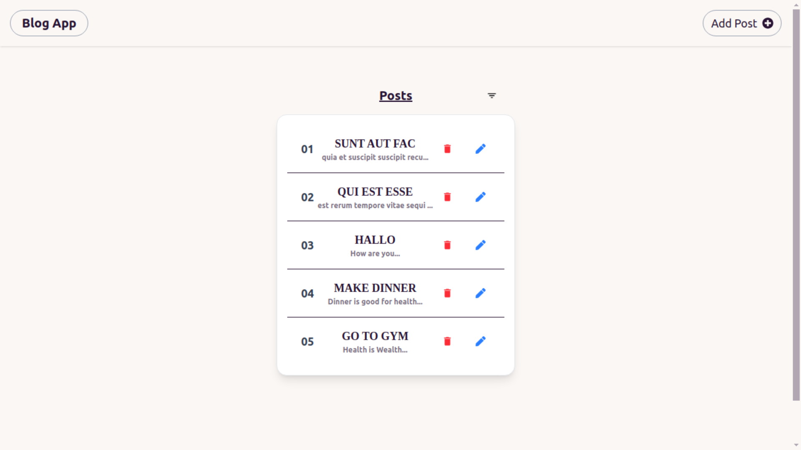
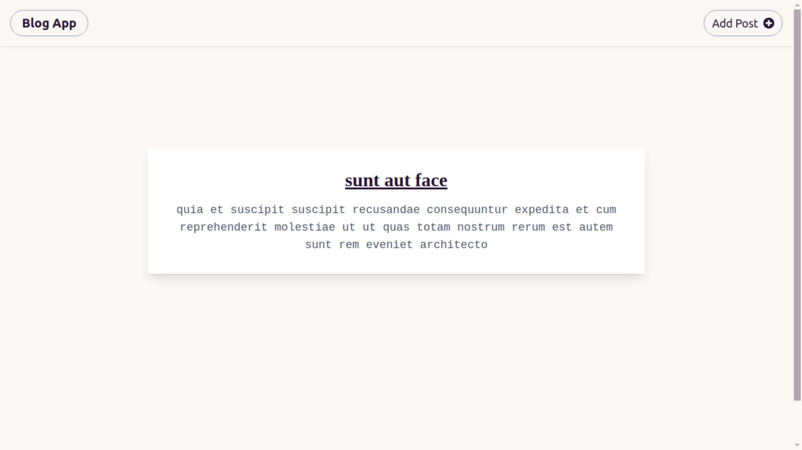
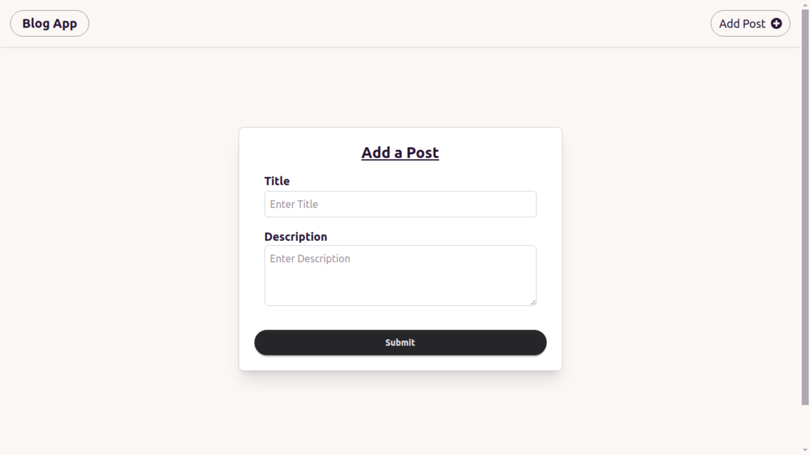
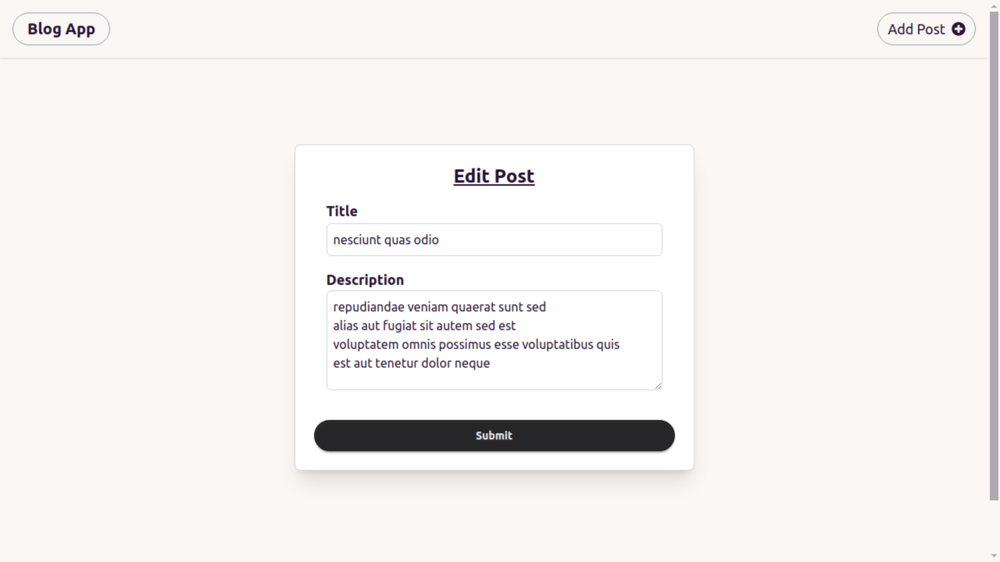
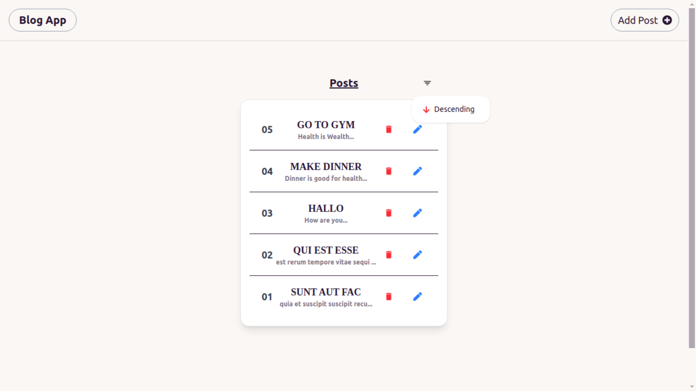

# Blog App

A user-friendly blog application that allows users to create, edit, and delete posts effortlessly. It provides a clean and fully responsive design, fetching posts dynamically from the JSONPlaceholder API.

## Features

- Add a new post with a title and body
- Edit an existing post
- Delete a post
- Fetch posts from JSONPlaceholder API
- Responsive UI with Tailwind CSS and DaisyUI
- Filter option to sort posts in ascending and descending order


## Technologies Used

- TypeScript
- React
- Tailwind CSS
- DaisyUI
- Zustand (state management)
- Axios (for API requests)
- React Router DOM (for navigation)

## Installation & Setup

Follow these steps to run the project locally:

1. Clone the repository:
   ```sh
   git clone <repository-url>
   ```
2. Navigate to the project directory:
   ```sh
   cd frontend
   ```
3. Install dependencies:
   ```sh
   npm install
   ```
4. Start the development server:
   ```sh
   npm run dev
   ```

The app should now be running at `http://localhost:5173/` (or the port specified in Vite).

## Screenshots







## License

This project is open-source and available under the [MIT License](LICENSE).

